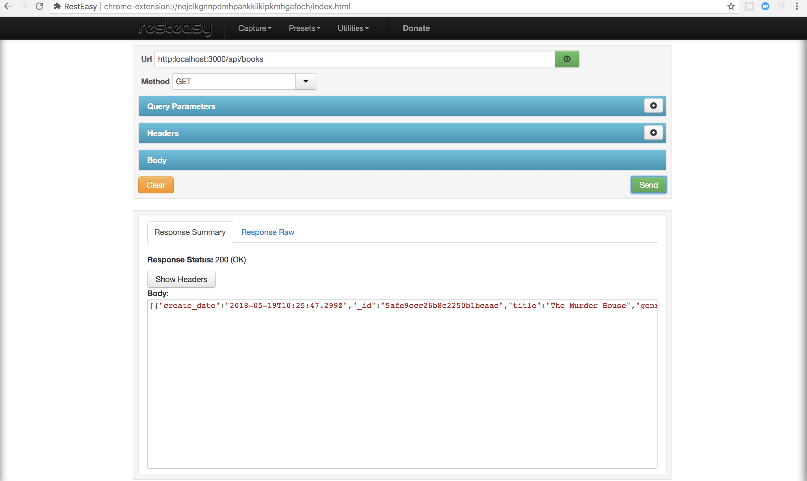

# BookStoreApi
This is an API written in NodeJs. It is a bookstore API that enables a user to add books and genres and manipulation. It is consumed by the frontend in AngularJs

The video tutorial that can help you come up with a project like this can be found [Here](https://www.youtube.com/watch?v=eB9Fq9I5ocs&t=3022s)

### Usage
Just clone this repo or download it and run **npm install** to install all dependencies.
After run **node app** or **nodemon** to start.

### Testing Endpoints
You can use Resteasy which is a chrome app or Postman which is also a chrome app or any other client that tests API endpoints.

## Resteasy snapshot

